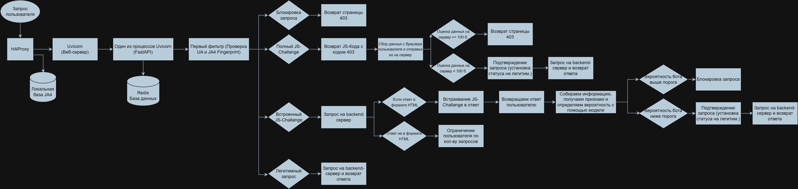

# Byte4Byte

Byte4Byte - многоуровневая система скрытой защиты веб-приложений от автоматизированного трафика и атак прикладного уровня (L7).  
Система работает в формате reverse-proxy и объединяет сетевой анализ, активные JavaScript-челленджи и поведенческую модель машинного обучения.

-

## Архитектура

Компоненты:

- **HAProxy** - SSL, балансировка, rate-limit, получение JA4  
- **FastAPI + Uvicorn** - reverse-proxy и логика защиты  
- **Redis** - хранение сессий и челленджей  
- **PostgreSQL** - база данных для логирования  
- **Streamlit + Plotly** - веб-панель статистики  


-

## Установка

### 0. Клонирование репозитория
```bash
git clone https://github.com/SemkaShr/byte4byte
```

### 1. Установка зависимостей

```bash
apt update
apt install nodejs npm haproxy redis postgresql postgresql-contrib
sudo systemctl enable --now postgresql
````

-

### 2. Настройка PostgreSQL

```bash
sudo -u postgres psql
CREATE ROLE byte4byte_user WITH LOGIN PASSWORD 'YOUR_PASSWORD';
CREATE DATABASE byte4byte OWNER byte4byte_user;
\q
```

-

### 3. Клонирование проекта

```bash
git clone https://github.com/SemkaShr/byte4byte
cd byte4byte
```

-

### 4. Установка Python-окружения

```bash
pip install uv
uv sync
```

-

### 5. Установка обфускатора JavaScript

```bash
npm install --save-dev javascript-obfuscator
```

-

### 6. Настройка HAProxy

```bash
cp docs/haproxy/ja4.lua /etc/haproxy/ja4.lua
cp docs/haproxy/ja4.map /etc/haproxy/ja4.map
cp docs/haproxy/haproxy.cfg.example /etc/haproxy/haproxy.cfg

systemctl restart haproxy
```

-

### 7. Конфигурация приложения

Отредактируйте `appConfig.py`:

```python
from app.endpoint import Endpoint
from app.ray.group import Group as RayGroup
from config import SEARCH_SYSTEMS_BOT

import app.haproxy
import app.router

def init(hap: app.haproxy.HAProxy, router: app.router.Router):
    rayGroup = RayGroup('site')
    point = Endpoint('domain.example.com', 'https://backend-ip/', rayGroup)

    rayGroup.whitelistAdd('ip or subnet')
    rayGroup.whitelistAdd(*SEARCH_SYSTEMS_BOT)
```

-

### 8. Настройка базы данных

Отредактируйте `dbConfig.py`:

```python
DB_NAME = 'byte4byte'
DB_USER = 'byte4byte_user'
DB_PASSWORD = 'YOUR_PASSWORD'
DB_PORT = 5432 
DB_HOST = 'localhost'
```

-

## Запуск

### Запуск системы защиты

```bash
./run.sh
```

### Запуск веб-панели статистики

```bash
./web.sh
```

-